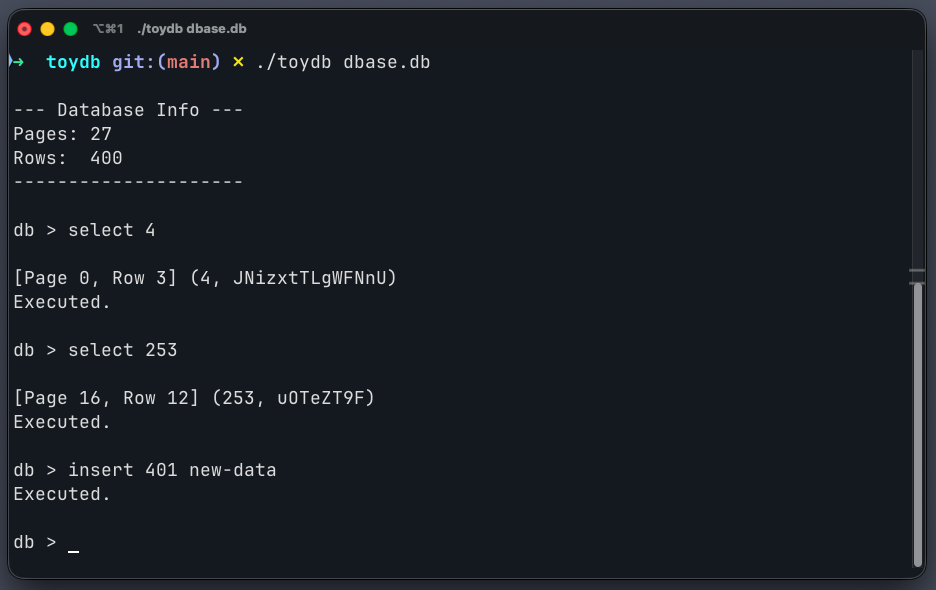

Welcome! In this series, we're going to build a toy relational database from scratch in C, heavily inspired by the architecture of SQLite. Our implementation will have a fixed schema, but it will be a real, functioning database that writes to disk.

> I am building this and writing this blog primarily to understand the internals of relational database systems. These systems have been around since the 80s, and I want to dive deep under the hood to really understand how they work in detail.

## Preface: The Journey Ahead

Here is the roadmap for what we aim to achieve throughout this blog series:
- We'll start by setting up a boilerplate and a simple parsing language for our relational database. In the beginning, we will just perform simple sequential scans (reading row by row from the disk).
- Slowly, we will move towards implementing B-Trees to make our searches fast and efficient.
- After that, we'll implement row deletions and cache optimizations to prevent reading the disk for every operation.
- Eventually, we'll build a TCP server over it, add support for more data types, and keep expanding on it slowly!

---

## Part 1: Setting up Structures, Insert, and Search

In this first part, we are focusing on getting a basic database engine up and running. We are setting up our internal data structures, establishing a way to read and write blocks of memory to a file on disk, and implementing simple `insert` and `select` functionality.

If you don't use C every day, don't worry! We will break down exactly how memory is being manipulated, how math is used to find records on disk, and how the operating system handles our files.

> Source code for this part is available at this [Commit (f398571)](https://github.com/nanorex07/toydb/tree/f3985718fd088f7c541a064ddf45b0938955cddf) for [Toydb's Github Repo](https://github.com/nanorex07/toydb)

By the end of this part we'll have a working CLI that can insert and search for records in a database file.



Let's dive into the codebase. I've broken the code down file by file, starting from the lowest level (how data looks) all the way up to the main program loop.

### 1. The Record Layer

Before we can store data, we need to know exactly what our data looks like and how much space it takes up. In this toy database, we are using a **fixed-width schema**. This means every single row in our database takes up the exact same number of bytes. 

Here are the definitions from `record.h`:

```c
#define COLUMN_DATA_SIZE 256

typedef struct {
    uint32_t id;
    char data[COLUMN_DATA_SIZE];
} Row;

#define ROW_SIZE 260
#define PAGE_SIZE 4096
#define ROWS_PER_PAGE 15
#define PAGE_HEADER_SIZE 4
```

**Understanding the Math:**
- `id` is a `uint32_t` (an unsigned 32-bit integer). 32 bits divided by 8 bits/byte equals **4 bytes**.
- `data` is an array of 256 characters. Since a `char` is exactly 1 byte in C, this takes up **256 bytes**.
- Together, `4 + 256 = 260 bytes`. That is our `ROW_SIZE`. Every single row will always be exactly 260 bytes.

We also define our `PAGE_SIZE` as `4096` bytes ($4$ KB). This is a magic number in computing because most operating systems (like Linux and macOS) read and write to the hard drive in 4KB chunks. If we align our database to 4KB blocks, disk I/O becomes much faster and simpler.

If a page is 4096 bytes and a row is 260 bytes, how many rows can fit in one page?
`4096 / 260 = 15.75`
So, we can comfortably fit **15 rows** inside a single page (`ROWS_PER_PAGE`).
15 rows $\times$ 260 bytes = 3900 bytes. This leaves us with 196 unused bytes at the end of every page. We use the very first 4 bytes of these 4096 bytes as a **Page Header** (`PAGE_HEADER_SIZE`) to keep track of how many rows are currently sitting inside this specific page.

Now, let's look at `record.c` to see how we safely move these rows around in memory:

```c
void serialize_row(Row* source, void* destination) {
    memcpy(destination, &(source->id), sizeof(uint32_t));
    memcpy((char*)destination + sizeof(uint32_t), &(source->data), COLUMN_DATA_SIZE);
}

void deserialize_row(void* source, Row* destination) {
    memcpy(&(destination->id), source, sizeof(uint32_t));
    memcpy(&(destination->data), (char*)source + sizeof(uint32_t), COLUMN_DATA_SIZE);
}

void print_row(Row* row) {
    printf("(%d, %s)\n", row->id, row->data);
}
```

**Why don't we just copy the whole struct?**
In C, you might be tempted to just do `memcpy(destination, source, sizeof(Row))`. However, C compilers are sneaky. To make the CPU run faster, compilers sometimes inject invisible "padding" bytes between variables in a struct. If we copy the raw struct directly to disk, those garbage padding bytes get written too, which can corrupt our database if we read it back on a different computer architecture. 

By manually using `memcpy` to copy exactly 4 bytes of the `id`, and then explicitly moving the destination pointer forward by 4 bytes before copying the 256 bytes of `data`, we guarantee that our data is packed perfectly tight with zero padding. 

### 2. The Pager

The Pager is our lowest-level abstraction for the hard drive. The database logic doesn't want to know about files or hard drives; it just wants to ask for "Page 0" or "Page 5" and get a 4KB block of memory back.

First, the `pager.h` structures:
```c
typedef struct {
  int file_descriptor;
  uint32_t file_length;
} Pager;
```
A `file_descriptor` is just an integer that the Operating System gives us to identify an open file.

Now, the `pager.c` implementation:
```c
Pager *pager_open(const char *filename) {
  int fd = open(filename,
                O_RDWR |     // Read/Write mode
                    O_CREAT, // Create file if it does not exist
                S_IWUSR |    // User write permission
                    S_IRUSR  // User read permission
  );

  if (fd == -1) {
    printf("Unable to open file\n");
    exit(EXIT_FAILURE);
  }

  off_t file_length = lseek(fd, 0, SEEK_END);

  Pager *pager = malloc(sizeof(Pager));
  pager->file_descriptor = fd;
  pager->file_length = file_length;

  return pager;
}

uint32_t page_count(Pager *pager) {
  return pager->file_length / PAGE_SIZE +
         (pager->file_length % PAGE_SIZE > 0 ? 1 : 0);
}

void *get_page(Pager *pager, uint32_t page_num) {
  void *page = calloc(1, PAGE_SIZE);

  uint32_t num_pages = page_count(pager);

  if (page_num < num_pages) {
    lseek(pager->file_descriptor, page_num * PAGE_SIZE, SEEK_SET);
    ssize_t bytes_read = read(pager->file_descriptor, page, PAGE_SIZE);
    if (bytes_read == -1) {
      printf("Error reading file: %d\n", errno);
      exit(EXIT_FAILURE);
    }
  }

  return page;
}

void flush_page(Pager *pager, uint32_t page_num, void *page) {
  off_t offset = lseek(pager->file_descriptor, page_num * PAGE_SIZE, SEEK_SET);

  if (offset == -1) {
    printf("Error seeking: %d\n", errno);
    exit(EXIT_FAILURE);
  }

  ssize_t bytes_written = write(pager->file_descriptor, page, PAGE_SIZE);

  if (bytes_written == -1) {
    printf("Error writing: %d\n", errno);
    exit(EXIT_FAILURE);
  }

  off_t new_length = lseek(pager->file_descriptor, 0, SEEK_END);
  pager->file_length = new_length;

  free(page);
}

void free_page(void *page) { free(page); }
```

**Understanding Disk I/O:**
- **`pager_open`**: The `open` function asks the OS to unlock the file for us. We pass `O_CREAT` so the file is created if this is a brand new database. Next, we use `lseek(fd, 0, SEEK_END)`. The `lseek` function moves the OS's hidden "cursor" inside the file. Moving it 0 bytes from the `SEEK_END` puts the cursor at the very end of the file, and conveniently, it returns the total number of bytes in the file! We save this as `file_length`.
- **`get_page`**: When the database asks for a page (e.g., `page_num = 2`), we first allocate a pristine 4096-byte chunk of memory using `calloc` (which fills it with zeros). If `page_num` is an existing page (meaning it falls within our `file_length`), we use `lseek` to jump to `page_num * 4096` bytes deep into the file, and `read` 4096 bytes directly into our memory block.
- **`flush_page`**: When we are done editing a page, we must save it permanently. We `lseek` to the correct byte offset again, and `write` the 4096 bytes from memory back onto the hard drive. 

> **Tradeoff:** In this Phase, our code is incredibly strict. Every single time we want a row, we hit the physical hard drive. Every time we insert a row, we hit the physical hard drive. Hard drives are terribly slow compared to RAM. In real databases (and in our future parts), we will build a "Buffer Pool" that keeps thousands of recently used pages alive in RAM, only flushing them to disk when absolutely necessary.

### 3. The Table

While the Pager manages raw bytes, the Table gives context to those bytes, keeping track of how many records we actually have.

```c
typedef struct {
    Pager* pager;
    uint32_t num_rows;
} Table;
```

```c
Table *db_open(const char *filename) {
  Pager *pager = pager_open(filename);
  Table *table = malloc(sizeof(Table));
  table->pager = pager;
  table->num_rows = 0;

  uint32_t num_pages = page_count(pager);
  for (uint32_t i = 0; i < num_pages; i++) {
    void *page = get_page(pager, i);
    uint32_t *num_rows_in_page = (uint32_t *)page;
    table->num_rows += *num_rows_in_page;
    free_page(page);
  }

  return table;
}

void db_close(Table *table) {
  close(table->pager->file_descriptor);
  free(table->pager);
  free(table);
}
```

**Rebuilding State:**
When you turn on the database, `db_open` calculates the total number of records by opening every single page using `get_page`. It then casts the page's memory pointer to an integer pointer (`uint32_t *num_rows_in_page = (uint32_t *)page`). This means it looks at the very first 4 bytes of that 4096-byte chunk, which we reserved earlier! By adding up the values stored in those 4-byte headers across all pages, the Table knows exactly how many rows exist globally (`table->num_rows`).

### 4. The Cursor

When you search for something in a database, you need to iterate over rows. A cursor is an abstraction that acts like a finger pointing at a specific row.

```c
typedef struct {
    Table* table;
    uint32_t row_num;
    bool end_of_table;
} Cursor;
```

```c
Cursor* table_start(Table* table) {
    Cursor* cursor = malloc(sizeof(Cursor));
    cursor->table = table;
    cursor->row_num = 0;
    cursor->end_of_table = (table->num_rows == 0);
    return cursor;
}

Cursor* table_end(Table* table) {
    Cursor* cursor = malloc(sizeof(Cursor));
    cursor->table = table;
    cursor->row_num = table->num_rows;
    cursor->end_of_table = true;
    return cursor;
}

void cursor_advance(Cursor* cursor) {
    cursor->row_num += 1;
    if (cursor->row_num >= cursor->table->num_rows) {
        cursor->end_of_table = true;
    }
}
```

If we want to read all records, we get a cursor at row 0 (`table_start`) and call `cursor_advance` until `end_of_table` is true. If we want to insert a brand new record, we get a cursor pointing to the very end (`table_end`), which tells us exactly what absolute row number we are writing to.

### 5. The Executor

This is where the magic happens. The executor bridges the gap between logical commands (like "insert this data") and physical bytes. 

```c
void execute_insert(Statement *statement, Table *table) {
  if (table->num_rows >= ROWS_PER_PAGE * 1000) {
    printf("Error: Table full.\n");
    return;
  }

  Cursor *cursor = table_end(table);

  uint32_t page_num = cursor->row_num / ROWS_PER_PAGE;
  void *page = get_page(table->pager, page_num);

  uint32_t row_offset = cursor->row_num % ROWS_PER_PAGE;
  void *destination = (char *)page + PAGE_HEADER_SIZE + row_offset * ROW_SIZE;

  serialize_row(&(statement->row_to_insert), destination);

  uint32_t *num_rows_in_page = (uint32_t *)page;
  (*num_rows_in_page)++;

  flush_page(table->pager, page_num, page);

  table->num_rows++;
  free(cursor);
}
```

#### The Pointer Arithmetic Masterclass

If you aren't familiar with low-level C memory manipulation, `execute_insert` might look intimidating. Let's break it down line by line.

We have an absolute row number (for example, `row_num = 17`). We need to turn that single number into a physical address in our computer's RAM.

1. **Which Page?** `uint32_t page_num = 17 / 15;` (Since integer math drops decimals, this equals `1`). So we know row 17 lives in Page 1! We ask the pager to fetch Page 1.
2. **Which Row Inside That Page?** `uint32_t row_offset = 17 % 15;` (The remainder of 17 / 15 is `2`). So inside Page 1, it is the 3rd row (index 2).

Now, we have a `void *page` which is the start of a 4096-byte chunk of RAM. How do we find the exact byte where index 2 starts?

```c
void *destination = (char *)page + PAGE_HEADER_SIZE + row_offset * ROW_SIZE;
```

- `(char *)page`: We cast the `void*` pointer to a `char*`. In C, a `char` is guaranteed to be exactly 1 byte. By making it a `char` pointer, whenever we do `+ 1`, we are telling the computer to move forward by exactly 1 byte in memory.
- `+ PAGE_HEADER_SIZE`: The first 4 bytes of our page are off-limits because they hold the row count. We add 4 to jump cleanly over them.
- `+ (2 * 260)`: We want index 2. So we need to jump completely over index 0 and index 1. We multiply our `row_offset` by our fixed `ROW_SIZE` to calculate that we need to jump 520 bytes forward.

Let's look at a diagram of our 4096-byte page:

```txt
Size of Row = 260 Bytes
| Header (4 Bytes) | Row 0 | Row 1 | Row 2 (Target) | Remaining Unused Bytes |
``` 

The pointer lands exactly on the first byte of the empty slot! We call `serialize_row` to squish our struct into those bytes. 

Finally, we update the page header:
```c
uint32_t *num_rows_in_page = (uint32_t *)page;
(*num_rows_in_page)++;
```
By casting the start of the page back to an integer pointer and incrementing it, we are directly editing those first 4 bytes. We then `flush_page` to save all this beautiful pointer math to the physical hard drive.

#### Selecting Data

```c
void execute_select(Statement *statement, Table *table) {
  Cursor *cursor = table_start(table);
  Row row;
  bool found = false;

  while (!(cursor->end_of_table)) {
    uint32_t page_num = cursor->row_num / ROWS_PER_PAGE;
    void *page = get_page(table->pager, page_num);

    uint32_t row_offset = cursor->row_num % ROWS_PER_PAGE;
    void *source = (char *)page + PAGE_HEADER_SIZE + row_offset * ROW_SIZE;

    deserialize_row(source, &row);

    if (statement->select_all || row.id == statement->select_id) {
      printf("\n[Page %d, Row %d] ", page_num, row_offset);
      print_row(&row);
      found = true;
      if (!statement->select_all) {
        free_page(page);
        break;
      }
    }

    free_page(page);
    cursor_advance(cursor);
  }

  if (!statement->select_all && !found) {
      printf("Record not found.\n");
  }

  free(cursor);
}
```

`execute_select` uses the exact same math, but it loops from the beginning of the table to the end. It uses the `deserialize_row` function to turn the raw bytes back into a readable C struct. If the row's ID matches what the user typed, we print it to the screen!

### 6. The Compiler

Before the executor can do its job, we have to turn user text (like `"insert 1 hello"`) into a `Statement` structure.

```c
typedef enum { STATEMENT_INSERT, STATEMENT_SELECT } StatementType;

typedef struct {
    StatementType type;
    Row row_to_insert;
    uint32_t select_id;
    bool select_all;
} Statement;
```

```c
MetaCommandResult do_meta_command(InputBuffer* input_buffer) {
    if (strcmp(input_buffer->buffer, ".exit") == 0) {
        return META_COMMAND_EXIT;
    } else {
        return META_COMMAND_UNRECOGNIZED_COMMAND;
    }
}

PrepareResult prepare_statement(InputBuffer* input_buffer, Statement* statement) {
    if (strncmp(input_buffer->buffer, "insert", 6) == 0) {
        statement->type = STATEMENT_INSERT;
        int args_assigned = sscanf(
            input_buffer->buffer, "insert %d %255s", &(statement->row_to_insert.id),
            statement->row_to_insert.data);
        if (args_assigned < 2) {
            return PREPARE_SYNTAX_ERROR;
        }
        return PREPARE_SUCCESS;
    }
    if (strncmp(input_buffer->buffer, "select", 6) == 0) {
        statement->type = STATEMENT_SELECT;
        char arg[256];
        int args_assigned = sscanf(input_buffer->buffer, "select %255s", arg);
        if (args_assigned < 1) {
            return PREPARE_SYNTAX_ERROR;
        }
        if (strcmp(arg, "*") == 0) {
            statement->select_all = true;
        } else {
            statement->select_all = false;
            statement->select_id = atoi(arg);
        }
        return PREPARE_SUCCESS;
    }

    return PREPARE_UNRECOGNIZED_STATEMENT;
}
```

**String Parsing:**
We use `strncmp` to check the first 6 characters of what the user typed. If it says `insert`, we use C's `sscanf` to automatically extract the integer and the string and save them directly into the `row_to_insert` embedded inside our `Statement` struct. This isolates string processing from database logic!

### 7. Input Buffer and Main Loop

Finally, we tie it all together with an interactive prompt. 

**input_buffer.h & .c**
```c
typedef struct {
    char* buffer;
    size_t buffer_length;
    ssize_t input_length;
} InputBuffer;
```
```c
InputBuffer* new_input_buffer(void) {
    InputBuffer* input_buffer = (InputBuffer*)malloc(sizeof(InputBuffer));
    input_buffer->buffer = NULL;
    input_buffer->buffer_length = 0;
    input_buffer->input_length = 0;
    return input_buffer;
}

void read_input(InputBuffer* input_buffer) {
    ssize_t bytes_read = getline(&(input_buffer->buffer), &(input_buffer->buffer_length), stdin);
    if (bytes_read <= 0) {
        printf("Error reading input\n");
        exit(EXIT_FAILURE);
    }
    input_buffer->input_length = bytes_read - 1;
    input_buffer->buffer[bytes_read - 1] = 0;
}

void close_input_buffer(InputBuffer* input_buffer) {
    free(input_buffer->buffer);
    free(input_buffer);
}
```
The `getline` function dynamically allocates enough memory to hold whatever the user types, preventing buffer overflow attacks that plague older C programs.

**main.c**
```c
void print_prompt(void) { printf("db > "); }

void print_db_info(Table *table) {
  printf("\n--- Database Info ---\n");
  printf("Pages: %d\n", page_count(table->pager));
  printf("Rows:  %d\n", table->num_rows);
  printf("---------------------\n\n");
}

int main(int argc, char *argv[]) {
  if (argc < 2) {
    printf("Must supply a database filename.\n");
    exit(EXIT_FAILURE);
  }

  char *filename = argv[1];
  Table *table = db_open(filename);

  print_db_info(table);

  InputBuffer *input_buffer = new_input_buffer();

  while (true) {
    print_prompt();
    read_input(input_buffer);

    if (input_buffer->buffer[0] == '.') {
      switch (do_meta_command(input_buffer)) {
      case (META_COMMAND_SUCCESS):
        continue;
      case (META_COMMAND_EXIT):
        db_close(table);
        close_input_buffer(input_buffer);
        exit(EXIT_SUCCESS);
      case (META_COMMAND_UNRECOGNIZED_COMMAND):
        printf("Unrecognized command '%s'\n", input_buffer->buffer);
        continue;
      }
    }

    Statement statement;
    switch (prepare_statement(input_buffer, &statement)) {
    case (PREPARE_SUCCESS):
      break;
    case (PREPARE_SYNTAX_ERROR):
      printf("Syntax error. Could not parse statement.\n");
      continue;
    case (PREPARE_UNRECOGNIZED_STATEMENT):
      printf("Unrecognized keyword at start of '%s'.\n", input_buffer->buffer);
      continue;
    }

    execute_statement(&statement, table);
  }

  return 0;
}
```

When you start the program, `main.c` opens the database file, prints some quick info about how big the database currently is, and drops you into a `while(true)` loop (the REPL). The `input_buffer` grabs your line of text, feeds it into the compiler, and if everything checks out, feeds the compiled statement directly to the executor.

### 8. Testing with Random Data

Manually typing "insert" commands gets old very quickly. To test if our database can handle hundreds of records and multiple pages, we use a simple Bash script to automate the process.

```bash
#!/bin/bash

# Configuration
TOTAL_INSERTS=400
DB_CMD="./toydb dbase.db"

generate_random_string() {
    local length=$((1 + RANDOM % 15))
    # LC_ALL=C forces tr to use the standard 'C' locale (ASCII/Byte)
    LC_ALL=C tr -dc 'a-zA-Z0-9' < /dev/urandom | head -c "$length"
}
echo "Starting data injection into toydb..."

# Use a subshell to group all echo outputs and pipe them once
{
    for ((i=1; i<=TOTAL_INSERTS; i++))
    do
        RAND_STR=$(generate_random_string)
        echo "insert $i $RAND_STR"
    done
    echo ".exit"
} | $DB_CMD

echo "Finished $TOTAL_INSERTS inserts."
```

**What's happening here?**

This script generates 400 random `insert` commands and pipes them directly into our `./toydb` executable. Since our database can hold 15 rows per page, 400 rows should create about 27 pages (`400 / 15`). 

This is a great way to verify:
1.  **Persistence**: After running the script, you can restart the DB and run `select *` to see all 400 records.
2.  **Page Allocation**: You can check the "Database Info" at startup to see if the page count matches our expectations.
3.  **Stability**: It ensures our pointer arithmetic doesn't crash when jumping across many different page boundaries.

---

That's it for Part 1! We've got a working, persistent toy database that can write 4KB chunks of structured data to our hard drive using precise memory arithmetic. Next time, we'll dive into the world of **B-Trees** and make our linear sequential searches lightning-fast.

